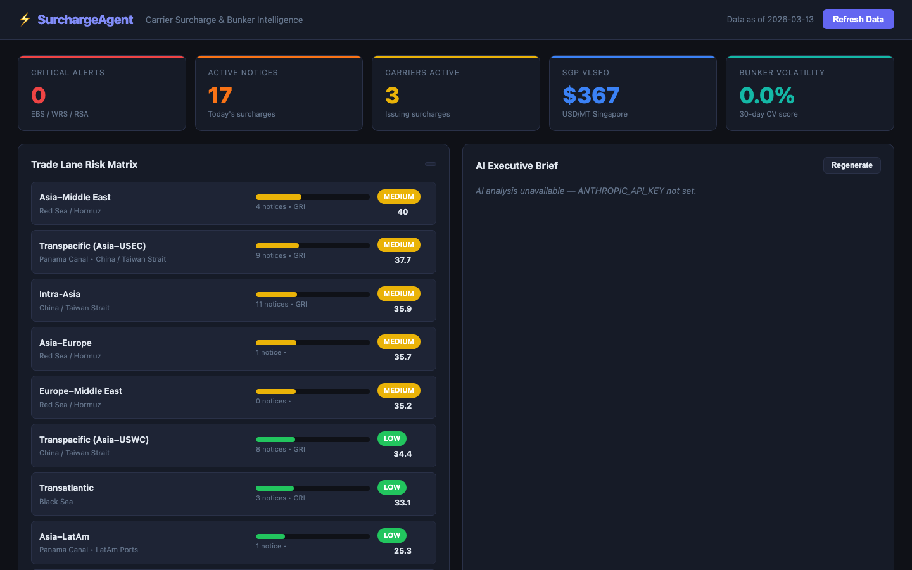

# SurchargeAgent

Carrier Surcharge & Bunker Intelligence Dashboard — real-time monitoring of emergency surcharges, bunker fuel rates, and geopolitical freight risk across global trade lanes.



## Features

- **Surcharge Notice Feed** — monitors 6 live RSS feeds (Freightos, The Loadstar, Splash247, TradeWinds, JOC, Hellenic Shipping News) and auto-extracts carrier, surcharge type, trade lane, USD amount, and effective date
- **Live Bunker Rates** — scrapes VLSFO / MGO / IFO380 prices at 10 major hubs (Singapore, Rotterdam, Fujairah, Houston, Shanghai, and more) from Ship & Bunker
- **Trade Lane Risk Matrix** — composite risk score (0–100) per lane weighted across geopolitical baseline, surcharge severity, bunker volatility, and notice velocity
- **Geopolitical Risk Zones** — Red Sea / Hormuz, Panama Canal, LatAm Ports, Taiwan Strait, Black Sea with baseline scores and affected lanes
- **Carrier Exposure Leaderboard** — ranks carriers by surcharge activity with type breakdown and affected lanes
- **AI Executive Brief** — Claude generates an 8-section HTML brief covering critical alerts, bunker analysis, lane risk, Iran/geopolitical focus, carrier strategy, cost-per-TEU estimates, and recommended actions
- **AI Q&A Chat** — ask ad-hoc questions about the surcharge landscape in natural language
- **Lane Deep Dive** — click any trade lane for a full risk breakdown and on-demand AI analysis
- **Auto-refresh** — APScheduler pipeline runs every 4 hours

## Stack

- Python 3.9 · FastAPI · Jinja2 · Uvicorn
- Anthropic SDK (`claude-opus-4-6`)
- BeautifulSoup4 · feedparser · APScheduler
- Chart.js (frontend)

## Quickstart

```bash
pip install -r requirements.txt
export ANTHROPIC_API_KEY=sk-...
python3 run.py
```

Open `http://localhost:8007`

## Surcharge Types Tracked

| Code | Name |
|------|------|
| EBS | Emergency Bunker Surcharge |
| BAF | Bunker Adjustment Factor |
| GRI | General Rate Increase |
| PSS | Peak Season Surcharge |
| WRS | War Risk Surcharge |
| RSA | Red Sea Avoidance Surcharge |
| SCS | Suez Canal Surcharge |
| PCS | Panama Canal Surcharge |
| PSC | Port Surcharge / Congestion |
| LSS | Low Sulphur Surcharge |
| ECS | Emergency Cost Surcharge |
| CAF | Currency Adjustment Factor |
